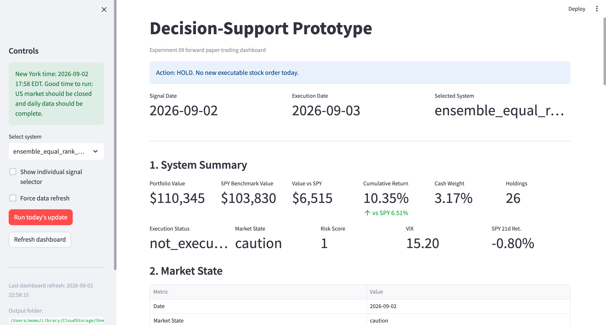

# Stock-Ranking Decision-Support Dashboard

This repository contains the forward stock-ranking decision-support prototype developed for an MSc dissertation on machine-learning-based cross-sectional stock ranking and portfolio decision-making.

## Dashboard Preview

<p align="center">
  
</p>

## Run Locally

```bash
pip install -r requirements.txt
python -m streamlit run app.py --server.fileWatcherType none
```

On the first run, if local dashboard outputs are missing, the app automatically runs `forward_engine.py` to download market data, train the selected models, generate rankings, update paper-trading accounts, and create the dashboard files.

Generated files are saved in `dashboard_outputs/`, which contains local cache files and paper-trading state.

## Notes

- The prototype uses Yahoo Finance data through `yfinance`, so an internet connection is required for data updates.
- The dashboard is for research and decision-support demonstration only. It does not place real trades.
